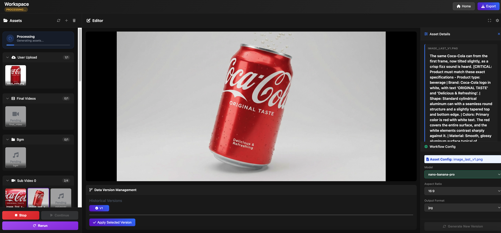

<div align="center"><a name="readme-top"></a>

# 🎬 Artalor - AI-Powered Video Creation Platform

### Create Professional Video with AI Agent

</div>

<hr/>

**Artalor** is an open-source, full-stack AI-powered platform that automatically generates professional consumer video from product images. Built with agentic workflows and modern web technologies, it's a **complete multi-modal creation tool** that handles every aspect of ad production across all modalities.

Upload a product image, and watch as AI generates:
- 📝 **Story Scripts** - Compelling narratives with timed segments
- 🎙️ **Voiceovers** - Natural-sounding audio narration
- 🎨 **Images** - Custom visuals for each scene
- 🎬 **Videos** - Professional video clips with effects
- 🎵 **Background Music** - Mood-appropriate soundtracks

All automatically assembled into a polished final video ad.

<div align="center">

**[🎥 View Showcase - See Demo Videos →](https://aiads.artaleai8.workers.dev/)**

</div>

### ⭐ 100% Open Source - 🎨 AI-Powered - 🎥 Full Automation

- ✅ **Zero Manual Editing** - Fully automated workflow from image to video
- ✅ **Fine-Grained Control** - Edit and regenerate individual assets (audio, video, images, BGM)
- ✅ **Intelligent Workflows** - LangGraph-based multi-node execution with caching
- ✅ **Real-Time Preview** - Interactive editor with text preview and regeneration
- ✅ **Local Deployment** - Run entirely on your infrastructure
- ✅ **Open Source** - Full transparency and customization

<br/>

<details>
<summary><kbd>Table of contents</kbd></summary>

#### TOC

- [🚀 Getting Started](#-getting-started)
  - [Prerequisites](#prerequisites)
  - [Installation](#installation)
  - [Running the Application](#running-the-application)
- [✨ Key Features](#-key-features)
  - [🤖 AI-Powered Workflow](#-ai-powered-workflow)
  - [🎨 Fine-Grained Asset Regeneration](#-fine-grained-asset-regeneration)
  - [🎵 Background Music Generation](#-background-music-generation)
  - [🔄 Incremental Workflow Rerun](#-incremental-workflow-rerun)
  - [👁️ Interactive Editor](#️-interactive-editor)
- [🎯 How It Works](#-how-it-works)
- [🛠️ Tech Stack](#️-tech-stack)
  - [Backend](#backend)
  - [Frontend](#frontend)
- [📁 Project Structure](#-project-structure)
- [🎬 Workflow Nodes](#-workflow-nodes)
- [🔧 Configuration](#-configuration)
- [🗺️ Roadmap](#️-roadmap)
- [🤝 Contributing](#-contributing)
- [📄 License](#-license)

#### 

<br/>

</details>

## 🚀 Getting Started

### Prerequisites

- **Python 3.8+** with pip
- **API Keys** for AI services:
  - OpenAI API key (for story script writing)
  - Replicate API key (for image/video/audio generation)

### Installation

1. **Clone the repository**

```bash
git clone https://github.com/artale-org/Artalor_Ads.git
cd Ads_full_stack
```

2. **Set up the backend**

```bash
cd backend

# Create and activate virtual environment
python -m venv .venv
source .venv/bin/activate  # On Windows: .venv\Scripts\activate

# Install dependencies
pip install -r requirements.txt
```

3. **Configure API keys**

You have two options:

**Option A: `.env` file** — Create a `.env` file in the `backend` directory:

```bash
OPENAI_API_KEY=your_openai_api_key_here
REPLICATE_API_TOKEN=your_replicate_token_here
```

**Option B: Web UI** — Click the **API Keys** button in the navigation bar after launching the app. Keys are stored in your browser and sent per-request.

4. **Configure models** (optional)

Edit `backend/config/models_config.json` to customize AI models for each workflow node.

### Running the Application

**Start the server** (serves both backend API and frontend):

```bash
cd backend
python server.py
```

Then open [http://localhost:5001](http://localhost:5001) in your browser.

## ✨ Key Features

### 🤖 AI-Powered Workflow

Artalor Ads employs a sophisticated LangGraph-based workflow that orchestrates multiple AI models to create professional ads:

- **Product Analysis** - Extracts product features, colors, and styling from uploaded images
- **Script Generation** - Creates compelling ad copy with segmented monologues
- **Voiceover Synthesis** - Generates natural-sounding audio narration
- **Storyboard Design** - Plans visual sequences with scene descriptions
- **Image Generation** - Creates custom visuals for each scene
- **Video Assembly** - Combines images, audio, and effects into final video
- **BGM Generation** - Produces mood-appropriate background music

<!--  -->

<br/>

### 🎨 Fine-Grained Asset Regeneration

Edit and regenerate individual assets without re-running the entire workflow:

- **Audio Segments** - Modify script text and regenerate specific voice segments
- **Video Clips** - Edit scene descriptions and regenerate individual clips
- **Images** - Update image prompts and regenerate specific frames
- **BGM** - Adjust mood keywords and regenerate background music

Only the edited asset regenerates—everything else uses cached results for maximum efficiency.

<!--  -->

<br/>

### 🎵 Background Music Generation

Intelligent BGM generation based on product analysis:

- Automatically extracts mood keywords from product styling
- Generates custom background music matching the ad's tone
- Editable mood keywords with instant regeneration
- Seamless integration with final video assembly

<br/>

### 🔄 Incremental Workflow Rerun

After regenerating assets, trigger an incremental workflow rerun:

- **Smart Execution** - Only re-executes nodes affected by changes
- **Dependency Tracking** - Automatically propagates changes downstream
- **Cache Preservation** - Unaffected nodes use cached results
- **Always Available** - Rerun button always enabled for maximum flexibility

<br/>

### 👁️ Interactive Editor

View and edit all generated assets in a unified interface:

- **Asset Browser** - Navigate through audio, video, images, and BGM
- **Text Preview Panel** - View contextual information for each asset
- **Inline Editing** - Edit text directly with visual feedback
- **Real-Time Updates** - Changes reflect immediately after regeneration
- **Workflow Controls** - Stop, continue, and rerun workflows on demand



<br/>

## 🎯 How It Works

1. **Upload Product Image** - Start by uploading a product photo
2. **AI Analysis** - System analyzes the product and extracts key features
3. **Workflow Execution** - Multi-node LangGraph workflow generates all assets
4. **Review & Edit** - Preview results in the interactive editor
5. **Fine-Tune** - Edit any asset and regenerate individually
6. **Rerun Workflow** - Trigger incremental rerun to propagate changes
7. **Download** - Export your final video ad

## 🛠️ Tech Stack

### Backend

- **Framework:** Flask (Python web server)
- **Workflow Engine:** LangGraph (state-based workflow orchestration)
- **AI Models:**
  - OpenAI GPT-4 (script generation, analysis)
  - Replicate (image and video generation)
  - Minimax TTS (voiceover synthesis)
  - Meta Musicgen (background music generation)
- **State Management:** LangGraph checkpoints with dirty flag tracking
- **File Processing:** PIL, MoviePy, Pydub

### Frontend

- **Framework:** Vanilla JavaScript (no build step required)
- **UI:** Custom CSS with modern gradients and animations
- **Media Playback:** HTML5 audio/video elements
- **Asset Management:** Dynamic loading with cache-busting
- **State Synchronization:** Polling-based updates


## 🎬 Workflow Nodes

The LangGraph workflow consists of these nodes:

1. **`image_understanding`** - Analyzes product image and extracts features
2. **`product_analysis`** - Determines styling, colors, and mood keywords
3. **`storyboard_design`** - Creates visual sequence plan
4. **`image_generation`** - Generates images for each storyboard frame
5. **`video_generation`** - Creates video clips from images
6. **`segmented_monologue`** - Generates script with timed segments
7. **`segmented_tts`** - Synthesizes voiceover audio for each segment
8. **`bgm`** - Generates background music based on mood
9. **`edit`** - Assembles final video with all assets

Each node can be executed independently for fine-grained regeneration.

## 🔧 Configuration

### Model Configuration

Edit `backend/config/models_config.json` to customize AI models:

```json
"image_generation": {
      "openai/gpt-image-1": {
        "description": "A multimodal image generation model that creates high-quality images. You need to bring your own verified OpenAI key to use this model. Your OpenAI account will be charged for usage.",
        "input_keys": {
          "input_fidelity": {
            "type": "string",
            "required": false,
            "description": "Control how much effort the model will exert to match the style and features, especially facial features, of input images"
          },
          ...
        },
      },
    },
"video_generation": {
    "openai/sora-2": {
    "description": "OpenAI's Flagship video generation with synced audio",
    "input_keys": {
        "prompt": {
        "type": "string",
        "required": true,
        "description": "A text description of the video to generate"
        },
        ...
      },
    },
}
```

### Workflow Configuration

Customize workflow behavior in `backend/config/ad_workflow_config_template.json`:

- Number of storyboard frames
- Video duration settings
- Audio segment timing
- Image generation parameters

## 🤝 Contributing

We welcome contributions! Here's how you can help:

1. **Report Bugs** - Open an issue with detailed reproduction steps
2. **Suggest Features** - Share your ideas for new functionality
3. **Submit PRs** - Fix bugs or implement new features
4. **Improve Docs** - Help us make documentation clearer

### Development Setup

```bash
# Fork and clone the repository
git clone https://github.com/YOUR_USERNAME/Artalor_Ads.git

# Create a feature branch
git checkout -b feature/your-feature-name

# Make your changes and commit
git commit -m "Add your feature"

# Push and create a pull request
git push origin feature/your-feature-name
```

## 📄 License

This project is licensed under the non-commercial license - see the [LICENSE.md](LICENSE.md) file for details.

---

<div align="center">

**Built with ❤️ by the Artalor Team**

[Report Bug](https://github.com/artale-org/Artalor_Ads/issues) · [Request Feature](https://github.com/artale-org/Artalor_Ads/issues) · [Documentation](https://github.com/artale-org/Artalor_Ads/wiki)

</div>
